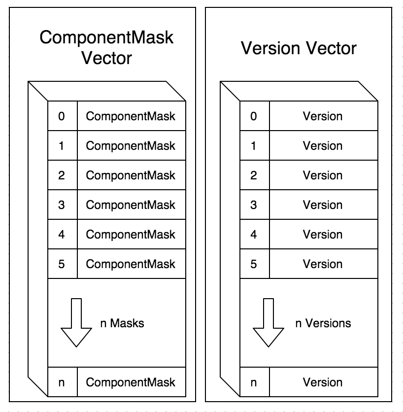
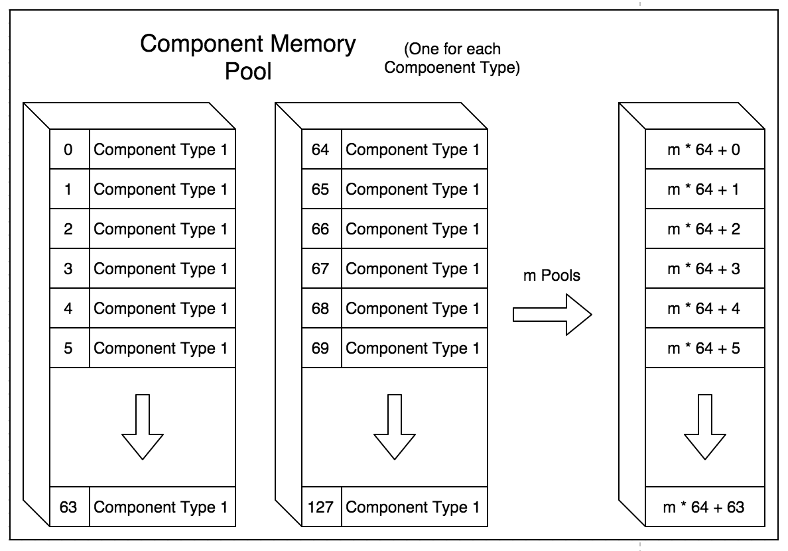

#OpenEcs - A fast, clean, typesafe, C++11, header only, Entity Component System

[](https://travis-ci.org/Gronis/OpenEcs) [](https://ci.appveyor.com/project/Gronis/openecs)

##What is OpenEcs?
Open Ecs is an Entity Component System that uses metaprogramming, cache coherency, and other useful tricks to maximize 
performance and configurability. It is written in c++11 without further dependencies.

NOTE: OpenEcs is still in beta and usage with the library might change. If you need a complete ECS library for a serious
project, I suggest looking further. I want more stuff like custom component allocators and perhaps a compile time 
configurable EntityManager and SystemManager. Some way to handle events might be useful to include.
Though, I don't want to bloat the lib with too much features. Let me know what you think and what is missing, I hope you enjoy using OpenEcs.

##Why OpenEcs?
I authored OpenEcs after using other ECS libraries. The main reason for this was that I wanted to write my own, and it 
wasn't supposed to become its own library. As I progressed, I thought it might be worth releasing it to the public as it 
slightly became a library with a different approach than the others.

OpenECS focuses on clean and understandable code that compiles to something with good performance, with good defaults, but still providing the ability to configure alternative behaviours when necessary.

##Installation
Just [Download](https://github.com/Gronis/OpenEcs/raw/master/single_include/ecs.h) the header and include it into your project.
Make sure to enable c++11 when compiling. (-std=c++11 or -std=c++0x)

##Support
OpenEcs support all mainstream compilers:
* gcc (tested with v4.8)
* clang
* MSVC (Visual Studio 2015)

##Standard Feature's:
The first thing you need is somewhere to store the entities. This is called the EntityManager and is created like this:
```cpp
using namespace ecs;
EntityManager entities;
```

Once the EntityManager is created. Adding entitites can be done like this

```cpp
EntityManager entities;

//Create one entity;
Entity entity = entities.create(); 

//Create 100 entities
vector<Entity> new_entities = entities.create(100);

//Create 100 entities and do something with them
entities.create(100, [] (Entity entity){
   //Do something with the added entity 
});
```

###Adding Components to entities
Adding components to entities is easy. But first we must define a Component. A Component can be any class or struct.

```cpp

struct Health{
    Health(int value) : value(value)
    int value;  
};

EntityManager entities;

//Create one entity;
Entity entity = entities.create(); 

//Add health component with a value of 10 to the entity
entity.add<Health>(10);

//The set function can be used even if health was added before.
entity.set<Health>(20);

//ERROR! Add only works when it doesn't already exists.
entity.add<Health>(10);// <- Assert failure, component already added
```

NOTE: In order to call the "set" method, the copy constructor for the component should not be deleted, as the copy constructor will be used if the entity already has a component of that type. However, "add" does not have this requirement, since we know that the entity does not have that component beforehand, and components without the copy constructor can be added.

```cpp
struct Health{
    Health(const & Health) = delete; //<-- removed copy constructor  
};

Entity entity = entities.create(); 
entity.set<Health>(10); //<-- compiler error, copy constructor deleted

entity.add<Health>(10); //<-- OK
```


To reduce boilerplate code, the constructor is optional. If setting variables is then only thing that happens in the constructor, leave it be.

```cpp
struct Health{
    int value; 
};

Entity entity = entities.create(); 
entity.add<Health>(10);

```
NOTE: This is provided by using uniform initialization, which means that the arguments must be exactly the same as the member variables of the component 

```cpp
entity.add<Health>(10.0f);// <- does not work, since float is not int
```

There is also a way to add components at the same time when creating an Entity by using the "create_with" method:

```cpp
entities.create_with<Health, Mana>(10, 5); //Adds health = 10 and mana = 5
//OR
entities.create_with(Health(10), Mana(5)); //Same as above.
//This is the same as doing this:
Entity entity = entity.create();
entity.add<Health>(10);
entity.add<Mana>(5);
```

Which one to use is up to you, though adding the components with one line gives information to the EntityManager
what components are comming, and the location of the entity in memory can be probably be better. 

### Accessing Components from entities
Accessing components is just as easy as adding them

```cpp
//Set health component with a value of 10 to the entity
entity.set<Health>(10);

//Access the Health Component
Health& health = entity.get<Health>();
health.value = 3;

//NOTE, you should use reference, not value.
//Otherwise, the components will be copied and
//any change made to it will not be registered
//on the actual component

//NOTE: Do not use (unless you know what you are doing)
Health health = entity.get<Health>();
health.value = 3;// <- does not change health of entity, 
//                     because variable is copied

```
Accessing a component which does not exist on a specified entity will trigger a runtime assertion. To check if an entity has a specified component, use the "has" function.

```cpp
Entity entity = entities.create();
bool has_health = entity.has<Health>(); //Returns false

entity.add<Health>(10);
has_health = entity.has<Health>(); //Returns true

```

### Removing Entities and Components

Destroying an entity can be done using the destroy method
```cpp
Entity entity = entities.create();
entity.destroy();
//or
entities.destroy(entity);
```

Removing Components is done by using the remove function
```cpp
Entity entity = entities.create();
entity.add<Health>(0);
entity.remove<Health>();
```
Destroying an entity removes all components and calls their destructors. it also opens that memory slot for another entity to take its place.

When an entity is destroyed. It is no longer valid, and any action used with it should not work
```cpp
entity.destroy();
//Does not work
entity.add<Health>(0); // <- triggers runtime assertion, Entity invalid

//Check if entity is valid
bool is_valid = entity.is_valid();
```

To track if an entity is valid. OpenEcs associates each entity with a version when accessed from the EntityManager. Whenever an entity is destroyed, the version for that Entity changes, and all entities with the old versions are invalid, as they no longer exists.

### Iterating through the EntityManager
To access entities with certain components. There is a "with" function that looks like this

```cpp
EntityManager entities;

//Iterate through the entities, grabbing each 
//entity with Health and Mana component
for(Entity entity : entities.with<Health, Mana>()){
    entity.get<Health>(); //Do things with health
    entity.get<Mana>(); //Do things with mana
}

//There is also a functional style iteration that works 
//with a provided lambda.
entities.with([](Health& health, Mana& mana){
    health.value = 2; //Do stuff
});

//If you need the entity, include it as well
entities.with([](Health& health, Mana& mana, Entity entity){
    health.value = 2; //Do stuff
    entity.remove<Health>();
});

```

NOTE, use reference, not values as parameters. (with the exception of Entity). Otherwise, the components will be copied and any change made to it will not be registered on the actual component.


```cpp
//Don't forget to use references ----
//                      |             \
//                      v              v
entities.with([](Health & health, Mana & mana){ });

```

###Systems
Systems define our behavior. The SystemManager provided by OpenEcs is very simple and is just a wrapper around an interface with an update function, together with the entities.

First we define our SystemManager

```cpp
EntityManager entities;
//We must provide what entities we like to work with
SystemManager systems(entities);
```

Then we create a system class.
Any new system class must inherit the System class like this:

```cpp
class RemoveCorpsesSystem : public System{
public:
    void update(float time) override {
        // Get the entity manager using entities() function
        for(auto entity : entities().with<Health>()){
            if(entity.get<Health>().value <= 0){
                //Destroy the entity
                entity.destroy();
            }
        }
    }
};

EntityManager entities;
SystemManager systems(entities);

systems.add<RemoveCorpsesSystem>( /*Provide any constructor arguments*/ );

//Here we update all systems
float deltaTime = 1;
systems.update(deltaTime); //Updates RemoveCorpsesSystem

//We can also remove systems when we do not need them
systems.remove<RemoveCorpsesSystem>();
systems.update(deltaTime);  //Does not updates any system

```

The systems are updated in the same order as they are added.

###Error handling
Any runtime or compile-time error should be handled by static or runtime assertions.

##Extra feature's
Aside from the normal usage of bitmasks for Component recognition and storing components in a vector for cache 
coherency, OpenEcs has some extra features.

###EntityAlias that enables object oriented interaction.

As an object oriented programmer, the ability to encapsulate the implementation as much as possible is desired. By using 
EntityAlias, an Entity can be wrapped inside these, witch then define all functions needed. then, the systems can 
interact with these EntityAliases instead of the entity. This takes no extra performance, and creates an abstraction 
later between actual ECS implementation and the desired action.

Defining an EntityAlias
```cpp
class Actor : public EntityAlias<Health, Name /* Any required component*/ >{
public:
    //here we can hide the implementation details of how the components
    //are used by the entity, and provide ordinary functions instead.
    void kill(){
        get<Health>().value = 0;
    }

    bool attack(Entity target){
        if(!has<AttackAction>()){
            add<AttackAction>(target);
            return true;
        }
        return false;
    }
};
```

NOTE: An EntityAlias class cannot define new member variables. It is only a wrapper between the
entity and the actual components. If new data needs to be associated with the entity, introduce 
new components instead

The EntityAlias assumes that the entity has all components provided by the inheritance.
We can get every entity that can be associated as an Actor (all entities with Health and Name in this case) by using the
"fetch_every" function, or a from a single Entity using the "as" function.

```cpp
EntityManager entities;

Entity entity = entities.create();
entity.add<Health>(0);
entity.add<Name>("");

// Access all entities that has all required components that an Actor has
for(Actor actor : entities.fetch_every<Actor>()){
    actor.kill(); //For example
}
//or with lambda
entities.fetch_every([](Actor& actor){
    actor.kill();
});

//Access one entity as EntityAlias
Actor actor = entity.as<Actor>();
```

The sweetness with using the "fetch_every" function is that it basically generates the same code as this:

```cpp
EntityManager entities;

for(auto entity : entities.with<Health, Name>()){
    entity.get<Health>().value = 0; // <- same as actor.kill();
}
```

This is very useful, as we get another abstraction layer without giving up performance.


NOTE: the "as" function will result in a runtime assertion error if the 
entity does not have the required components (Health and Name in this case)

Use "is" function to test if entity can be observed as an Actor

```cpp
// The "is" function will test if entity has all required components for Actor
if(entity.is<Actor>()){ // <- same as entity.has<Health, Name>()
    Actor actor = entity.as<Actor>(); // <- Safe to Access Entity Alias
} 
```


###Creating entities by using EntityAlias
By defining a constructor for the EntityAlias. We can use the create function from the EntityManager
like this:

```cpp
class Actor : public EntityAlias<Health, Name>{
//                                  ^      ^
//                                   \_____|
public://                                  |
    Actor(int health, std::string name){// |
        add<Health>(health);//             |
        add<Name>(name);//                 |
        //Make sure to add all required components.
        //If any required component is not added,
        //this will cause a runtime assertion failure

        //it is also important to use "add" instead of "set"
        //as "set" assumes that all required components are
        //already set for this entity (Since they are
        //required).
    }
};
```

Once we have the EntityAlias constructor, we can create
an entity using the "create" function.

```cpp
EntityManager entities;

//Create an actor with 10 health and named Evil Dude
Actor actor = entities.create<Actor>(10, "Evil Dude");

```
This results in a useful factory method for any EntityAlias. Another good thing is that what an Entity is, is defined by
its components, and enables entities to be several things at the same time, without using hierarchy (Which is the idea 
behind Entity Component Systems).

###Wait a bit...

You might start thinking "If all components should be added anyway. Why is the constructor needed?" I started thinking that too, and added a standard behavior. 

Considering the following code:

```cpp
//Components
struct Name {
    str::string value;
};
struct Height {
    int value;
};
struct Weight {
    int value;
};

//Since components have optional constructors, We can type like this
//to create an Actor (Entity with Name, Height and Weight)
auto entity = entities.create();
entity.add<Name>("Darth Vader");
entity.add<Height>(180);
entity.add<Weight>(75);

//But we want to use the EntityAlias class, because we know what an Actor is. 
//However, we don't want to write the constructor, because enough is specified 
//for the library to "figure out" how to create an Actor after specifying what 
//components it has. Therefore, we leave out the constructor.
class Actor : public EntityAlias<Name, Height, Weight> {};

//And then create an Actor like this
entities.create<Actor>("Darth Vader", 180, 75); 
//                          ^          ^   ^
//                          |          |   |
// Assumes constructor for Name       /    |
// Assumes constructor for Height ---´    /
// Assumes constructor for Weight -------´

//create<Actor> assumes that each parameter can add
//required components with that single argument.
class Actor : public EntityAlias<Name, Height, Weight> {
    //No constructor means the same thing as this constructor
    Actor(std::string name, int height, int weight){
        add<Name>(name);
        add<Height>(height);
        add<Weight>(weight);
    }
};
```

NOTE: This does not work when a required components needs more than one argument when creating the object. This is true with components like 2D velocity, and 2D position:

```cpp
//Components with MORE than 1 member variable
struct Velocity{ int x,y; };
struct Position{ int x,y; };

//EntityAlias
struct Movable : EntityAlias<Position, Velocity>{};

entities.create<Movable>(/*What to write here?*/);

//In order to create a movable without providing a constructor
//We must write like this.
entities.create<Movable>(Position{0,0}, Velocity{0,0});
//This calls the standard copy constructor for Position and
//Velocity component. 

//If we want to be able to write something like this:
entities.create<Movable>(0,0,0,0);
//We need to provide the following constructor, since
//there is not enough information specified for the
//library to understand how to add create a Movable.
struct Movable : EntityAlias<Position, Velocity>{
    Movable(int posX, int posY, int velX, int velY){
        add<Position>(posX, posY);
        add<Velocity>(velX, velY);
    }
};
```

Hopefully, this should help with quick creation of components and EntityAliases without typing "boilerplate code" for the lazy people (like me), while still allowing the flexibility of defining your own constructors when necessary.


###Override operators
It would be useful if the components override some basic operators for cleaner code.
```cpp
//Using == operator of component class
bool health_equals_mana = 
    entity.get<Health>() == entity.get<Mana>();

//If no operators are defined, we must write it like this
bool health_equals_mana = 
    entity.get<Health>().value == entity.get<Mana>().value;
```
However, defining operators for each component is just useless boilerplate code can be very anoying, time consuming, and difficult to write. If the component only has one property, in the case of Health in this example. There is a class called Property\<T\> which overrides useful operators. The Component class may extend this class to inherit some basic operators.

```cpp
struct Health : Property<int>{
  //Define constructor like this
  Health(int value) : Property<int>(value){};  
  //Or like this
  Health(int value){
    this->value = value;
  }; 
};

// Or skip the constructor entirely, like with usual components.
// However the assignment operator will not work without
// a given constructor.
struct Health : Property<int>{};

//Needs a constructor for assignment like this to work
entity.get<Health>() = 4;// <- needs a constructor to enable assignment

```

Now we should have some useful operator implementations for the health component which enables cleaner code

```cpp
// operator >
if(entity.get<Health>() > 10){
    
}
// without using operator >
if(entity.get<Health>().value > 10){
    
}
```
NOTE: Remember that any class can be a component, and that it is optional to use Property\<T\>, as overriding operators is not always desired. For those who does not what to use overridden operators, leave out the Property\<T\> class.

###Memory

The memory for components and entities are handled manually by OpenEcs. Entities are nothing more than a placeholder with its ID, and a pointer to its EntityManager. Entities are not stored, but created when returned from the API.

The ID for an entity is its index (Where its located) and a version (When reusing old indexes for removed entities). All versions for an Entity is stored in a std::vector continuously in memory, as a number.

Every component type gets its own id and a component mask, which tracks what components each entity has. These masks are placed in a std::vector, like the versions. Each bit represents if an entity has a component. By default, the component mask size is 64bits, which means that the max number of component types that can be used with OpenEcs is 64. This can be changed with a define like this BEFORE including the header. In this example, each component mask will be 128bits, and can therefore, OpenEcs will be able to keep track of 128 different component types.

```cpp
#define  ECS_MAX_NUM_OF_COMPONENTS 128
#include "ecs/ecs.h"
``` 



Each component type is handled by a component manager, which is basically a memory pool. The chunk size for a component manager's memory pool is <i>64 * s</i> bytes, where <i>s</i> is the size of the component type for the component manager. The number 64 is there because one chunk should at least fit on one or more cachelines in memory. There is no point in making it larger, and smaller reduces performance. Just as the versions, each component is located at the index for its entity ID.



The EntityManager allocates memory for each entity to have every component. This might sound stupid, but once memory is allocated, not using it does not cost any cpu time, and we still want the opportunity to add any component to an entity. However it's not cheap to load memory into the cpu. Therefore, the EntityManager tries to put "similar" entities together in memory when they are created. More about this can be read in the Performance section.


###Performance

On my Apple MBP Retina 13" 2014 computer, this is some performance tests using 10 000 000 entities with some components 
attached:

| Operation                                             |      Time     |
|-------------------------------------------------------|---------------|
| create()                                              |     0.38s     |
| create(10M)                                           |     0.17257s  |
| destroy()                                             |     0.16733s  |
| normal for-loop with if-case                          |     0.00652s  |
| iterating using with for-loop (without unpacking)     |     0.00847s  |
| iterating using with for-loop (unpack one component)  |     0.01125s  |
| iterating using with lambda (unpack one component)    |     0.01125s  |
| iterating using with for-loop (unpack two components) |     0.01600s  |
| iterating using with lambda (unpack two components)   |     0.01600s  |
| iterating using fetch_every for-loop                  |     0.00812s  |
| iterating using fetch_every lambda                    |     0.00812s  |

To improve performance, there are some guidelines:

Create entities by using EntityAlias or with "create_with\<Components...\>" function, as this gives the EntityManager an idea were to put the entities. The EntityManager tries to clump similar entities together in memory, in order to reduce cache misses when loading memory into the cache CPU memory. When creating entities like this:

```cpp
// The EntityManager has no idea what components are coming
// and and will probably put this entity near other entities
// that don't have similar components.
Entity e = entities.create();
e.add<SomeComponent>();
e.add<SomeOtherComponent>();
```

By doing this instead:

```cpp
// Here the EntityManager knows what components the Entity will 
// have, and will put it close to other entities which also had
// these components when created.
Entity e = entities.create_with<SomeComponent, SomeOtherComponent>(/* Args here */);
//or
auto e = entities.create<SomeEntityAlias>(/* Constructor args for SomeEntityAlias here */);
```

NOTE: Of course this means that adding or removing components from entities will result in cache misses anyway. This cannot be resolved, unless the entity components is moved in memory, which breaks the idea of that the index is part of the Entity ID. However, it is most likely that entities will retain most of its components over its lifecycle, and therefore, providing this information should result in a performance boost.


To improve performance iterate by using auto when iterating with a for loop

```cpp  
for(auto entity : entities.with<Health, Name>()){
//   ^
//   \ 
//    ` The type here will not become Entity, it will become EntityAlias<Health, Name>.
//      It will only use the normal Entity class if you tell it to.
}

```
When you use the function "get\<Health\>" on the Entity object,we need to perform some runtime checks. If you are using EntityAlias\<Health,Name\>, the compiler assumes that the entity has Health and Name components, and bypasses this check when accessing the component. We already do this runtime check when we iterate through the list. Why do it again?

```cpp  
for(auto entity : entities.with<Health, Name>()){
    entity.get<Health>(); // <- No runtime check. Fast
    entity.get<Mana>(); // <- Runtime check required. 
}

```

Or just use the lambda version of "with" or "fetch_every" function with your own EntityAliases, and you
are good to go!

```cpp  
entities.with([](Health& health, Name& name){ });
//or
entities.fetch_every([](Actor actor){ });

```

##A complete example
This examples illustrates two spellcasters: Alice and Bob, and their fight to the death. Prints the winner and remaining
health and mana.

```cpp
#include <iostream>
#include "ecs/ecs.h"

using namespace ecs;

//Components as properties, we skip defining a constructor, since we
//don't do anything unusual.
struct Health : Property<int>{};
struct Mana   : Property<int>{};
struct Name   : Property<std::string>{};

struct Spellcaster : public EntityAlias<Name, Health, Mana>{
    //We don't need to define a constructor since all of
    //our components only have 1 member.
    bool isOom(){
        return get<Mana>() == 0;// <- override == operator
    }

    bool isAlive(){
        return get<Health>() > 0;
    }
    void castSpell(Spellcaster& target){
        if(!isOom()){
            --get<Mana>();
            --target.get<Health>();
        }
    }
};

class RemoveCorpsesSystem : public System{
public:
    void update(float time) override {
        //Method 1
        //Any health entity
        entities().with([](Health& health, Entity entity){
           if(health <= 0){
               entity.destroy();
           }
        });
        //Method 2
        //Any spellcaster that is dead
        entities().fetch_every([](Spellcaster& spellcaster){
            if(!spellcaster.isAlive()){
                spellcaster.destroy();
            }
        });
    }
};

class CastSpellSystem : public System{
public:
    void update(float time) override {
        entities().fetch_every([&] (Spellcaster& spellcaster1){
            entities().fetch_every([&] (Spellcaster& spellcaster2){
                if(spellcaster1 != spellcaster2){
                    spellcaster1.castSpell(spellcaster2);
                }
            });
        });
    }
};

class GiveManaSystem : public System{
public:
    void update(float time) override {
        entities().fetch_every([] (Spellcaster& spellcaster){
            if(spellcaster.isOom()) spellcaster.set<Mana>(1337);
        });
    }
};

class Game{
public:
    Game() : systems(entities) {}
    void run(){
        systems.add<CastSpellSystem>();
        systems.add<GiveManaSystem>();
        systems.add<RemoveCorpsesSystem>();
        entities.create<Spellcaster>("Alice", 8, 12);
        entities.create<Spellcaster>("Bob", 12, 8);
        while(entities.count() > 1) systems.update(1);
        entities.with([] (Name& name, Health& health, Mana& mana){
            std::cout << name << " won!" << std::endl;
            std::cout << "Health: " << health << std::endl;
            std::cout << "Mana:   " << mana << std::endl;
        });
    }

private:
    EntityManager entities;
    SystemManager systems;
};

int main(){
    Game game;
    game.run();
}
```

Output:
```
Bob won!
Health: 4
Mana:   1337
```

##License
Copyright (C) 2015  Robin Grönberg

This program is free software: you can redistribute it and/or modify
it under the terms of the GNU General Public License as published by
the Free Software Foundation, either version 3 of the License, or
(at your option) any later version.

This program is distributed in the hope that it will be useful,
but WITHOUT ANY WARRANTY; without even the implied warranty of
MERCHANTABILITY or FITNESS FOR A PARTICULAR PURPOSE.  See the
GNU General Public License for more details.

You should have received a copy of the GNU General Public License
along with this program.  If not, see <http://www.gnu.org/licenses/>.